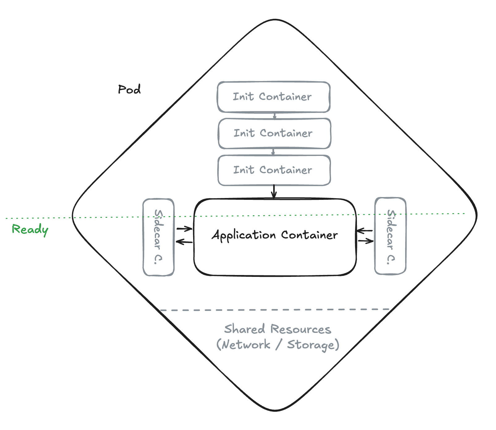

# Kubernetes-Ressourcen

Kubernetes verwaltet Anwendungen über deklarative **Ressourcen**, die als YAML-Manifeste beschrieben und auf den Cluster angewendet werden. Hier eine Übersicht der wichtigsten Ressourcen.

## Workloads

### Pod

Die kleinste bereitstellbare Einheit in Kubernetes — ein oder mehrere Container, die gemeinsam auf demselben Worker-Knoten laufen. Container innerhalb eines Pods teilen sich:

- denselben **Netzwerk-Namespace** (Kommunikation über `localhost`)
- optionale gemeinsame **Volumes**

Pods ermöglichen Muster wie das **Sidecar-Pattern**, bei dem ein Hilfs-Container (z.B. für Logging oder Proxying) neben dem Hauptcontainer läuft.



Der Pod ist auch die Einheit für **Lifecycle** und **Skalierung**: Kubernetes startet, stoppt und überwacht Pods als Ganzes. Soll eine Anwendung skaliert werden, werden zusätzliche Pod-Replicas erzeugt — nicht einzelne Container innerhalb eines Pods. Ebenso werden bei einem Rolling Update ganze Pods durch neue ersetzt.

Neben dem eigentlichen **App-Container** kann ein Pod weitere Container enthalten:

- **Init-Container** — laufen **vor** dem App-Container und müssen erfolgreich abschließen, bevor die Anwendung startet. Geeignet für Vorbereitungsaufgaben.
- **Sidecar-Container** — laufen **parallel** zum App-Container für die gesamte Lebensdauer des Pods. Geeignet für Querschnittsaufgaben.

| Szenario | App-Container | Init-Container | Sidecar-Container |
|----------|--------------|----------------|-------------------|
| **Web-App mit DB-Migration und Logging** | Anwendungsserver (z.B. Quarkus) | Führt vor dem App-Start Datenbankmigrationen aus (z.B. Liquibase, Flyway) — so ist das Schema garantiert aktuell, bevor die Anwendung startet | Log-Collector (z.B. Fluentd), der Logdateien aus einem gemeinsamen Volume ausliest und weiterleitet |
| **Transactional Outbox Pattern** | Microservice, der Geschäftslogik ausführt und Events in eine Outbox-Tabelle schreibt (in derselben DB-Transaktion) | — | Einfacher Poller, der regelmäßig die Outbox-Tabelle abfragt und Events an Kafka sendet (Alternative: Debezium mit CDC als eigenes Deployment) |
| **App mit TLS-Proxy** | Backend-Anwendung (nur HTTP) | Lädt Zertifikate aus einem Secret und legt sie im gemeinsamen Volume ab | Envoy/NGINX als Reverse Proxy, der TLS terminiert und Traffic an den App-Container weiterleitet |

Mehr dazu in der [Kubernetes-Dokumentation zu Pods](https://kubernetes.io/docs/concepts/workloads/pods/).

> In der Praxis erstellt man Pods nicht direkt, sondern über Deployments, die den gewünschten Zustand verwalten.

### Deployment

Verwaltet eine gewünschte Anzahl von Pod-Replicas und stellt sicher, dass immer die richtige Anzahl läuft. Deployments ermöglichen:

- **Rolling Updates** — schrittweises Ersetzen alter Pods durch neue
- **Rollbacks** — Rückkehr zu einer früheren Version
- **Skalierung** — Änderung der Replica-Anzahl

### ReplicaSet

Wird von einem Deployment automatisch erstellt und verwaltet. Stellt sicher, dass die gewünschte Anzahl identischer Pods läuft. Wird selten direkt konfiguriert.

### DaemonSet

Stellt sicher, dass auf **jedem** (oder ausgewählten) Knoten genau ein Pod läuft. Typische Einsatzgebiete: Log-Collector, Monitoring-Agents, Netzwerk-Plugins.

### StatefulSet

Wie ein Deployment, aber für **zustandsbehaftete** Anwendungen. Jeder Pod erhält eine stabile Identität (Name, Netzwerk, Speicher), die auch bei Neustarts erhalten bleibt. Geeignet für Datenbanken, Message Queues etc.

### Job / CronJob

- **Job** — führt einen oder mehrere Pods aus, bis sie erfolgreich abgeschlossen sind (z.B. Batch-Verarbeitung, Datenmigration)
- **CronJob** — plant Jobs nach einem Zeitplan (Cron-Syntax)

## Netzwerk

### Service

Stellt Pods unter einer stabilen IP-Adresse und einem DNS-Namen bereit. Kubernetes nutzt **kube-proxy**, der auf jedem Knoten virtuelle IP-Adressen den tatsächlichen Pod-IP-Adressen zuordnet. So bleibt die Adresse stabil, auch wenn Pods neu gestartet oder verschoben werden.

Service-Typen:

| Typ | Beschreibung |
|-----|-------------|
| **ClusterIP** | Nur innerhalb des Clusters erreichbar (Standard) |
| **NodePort** | Öffnet einen Port auf jedem Knoten |
| **LoadBalancer** | Erstellt einen externen Load Balancer (Cloud-Provider) |

### Ingress

Regelt den externen HTTP(S)-Zugriff auf Services im Cluster. Ermöglicht hostbasiertes und pfadbasiertes Routing sowie TLS-Terminierung. Erfordert einen **Ingress Controller** (z.B. NGINX, Traefik).

> **OpenShift** verwendet statt Ingress eigene **Route**-Ressourcen, die einfacher zu konfigurieren sind und TLS-Terminierung out-of-the-box bieten.

### NetworkPolicy

Definiert Netzwerkregeln, die den Traffic zwischen Pods einschränken (Firewall auf Pod-Ebene).

## Konfiguration

### ConfigMap

Speichert Konfigurationsdaten als Schlüssel-Wert-Paare. ConfigMaps können Containern als **Umgebungsvariablen** oder als **Dateien über Volumes** bereitgestellt werden.

### Secret

Ähnlich wie ConfigMaps, aber für **sensible Daten** (Passwörter, Tokens, Zertifikate). Secrets werden Base64-kodiert gespeichert und können durch Cluster-Richtlinien zusätzlich verschlüsselt werden.

## Speicher

### PersistentVolume (PV) / PersistentVolumeClaim (PVC)

- **PersistentVolume** — ein vom Administrator bereitgestelltes Speichermedium
- **PersistentVolumeClaim** — eine Anforderung an Speicher durch eine Anwendung

PVCs ermöglichen es, Speicher unabhängig vom Pod-Lebenszyklus zu verwalten — Daten bleiben auch erhalten, wenn ein Pod gelöscht wird.

### StorageClass

Definiert verschiedene Speichertypen (z.B. SSD, HDD, NFS) und ermöglicht **dynamische Provisionierung** — PVs werden automatisch erstellt, wenn ein PVC angelegt wird.

## Sicherheit & Zugriff

### Namespace

Ein Namespace ist eine **logische Isolation** innerhalb eines Clusters. Er ermöglicht die Trennung von Teams, Projekten oder Umgebungen (z.B. `dev`, `staging`, `prod`). Die meisten Kubernetes-Ressourcen (Pods, Services, ConfigMaps, Secrets etc.) gehören zu genau einem Namespace. Namespaces ermöglichen:

- **Organisatorische Trennung** — verschiedene Teams arbeiten im selben Cluster, ohne sich gegenseitig zu beeinflussen
- **Zugriffskontrolle** — über RBAC können Berechtigungen pro Namespace vergeben werden
- **Resource Quotas** — Begrenzung von CPU, Speicher und Anzahl der Ressourcen pro Namespace

Jeder Cluster hat standardmäßig die Namespaces `default`, `kube-system` und `kube-public`.

```bash
# Namespace erstellen
kubectl create namespace mein-projekt

# Ressourcen in einem Namespace anzeigen
kubectl get pods -n mein-projekt
```

### ServiceAccount

Identität für Pods, um sich gegenüber der Kubernetes-API oder externen Diensten zu authentifizieren.

### Role / ClusterRole + RoleBinding / ClusterRoleBinding

**RBAC** (Role-Based Access Control) — regelt, welche Benutzer und ServiceAccounts welche Aktionen auf welchen Ressourcen ausführen dürfen.

## Health Checks (Probes)

Kubernetes überwacht Container mit drei Arten von Probes:

| Probe | Beschreibung | Bei Fehlschlag |
|-------|-------------|----------------|
| **Liveness Probe** | Prüft, ob der Container lebt | Pod wird neu gestartet |
| **Readiness Probe** | Prüft, ob der Container bereit ist, Traffic zu empfangen | Pod wird aus dem Service entfernt |
| **Startup Probe** | Prüft, ob der Container gestartet ist | Liveness/Readiness werden erst danach aktiv |

Probe-Mechanismen: `httpGet`, `tcpSocket`, `exec` (Kommando im Container).

## Übersicht

| Kategorie | Ressourcen |
|-----------|-----------|
| Workloads | Pod, Deployment, ReplicaSet, DaemonSet, StatefulSet, Job, CronJob |
| Netzwerk | Service, Ingress, NetworkPolicy |
| Konfiguration | ConfigMap, Secret |
| Speicher | PersistentVolume, PersistentVolumeClaim, StorageClass |
| Sicherheit | Namespace, ServiceAccount, Role, ClusterRole, RoleBinding |

## Weiterführende Links

* [Kubernetes API-Referenz](https://kubernetes.io/docs/reference/kubernetes-api/)
* [Kubernetes Workloads](https://kubernetes.io/docs/concepts/workloads/)
* [Kubernetes Networking](https://kubernetes.io/docs/concepts/services-networking/)
* [Kubernetes Storage](https://kubernetes.io/docs/concepts/storage/)
* [Kubernetes RBAC](https://kubernetes.io/docs/reference/access-authn-authz/rbac/)
* [Kubernetes-Ressourcen im Überblick](https://kubernetes.io/docs/reference/kubectl/generated/kubectl_api-resources/)
